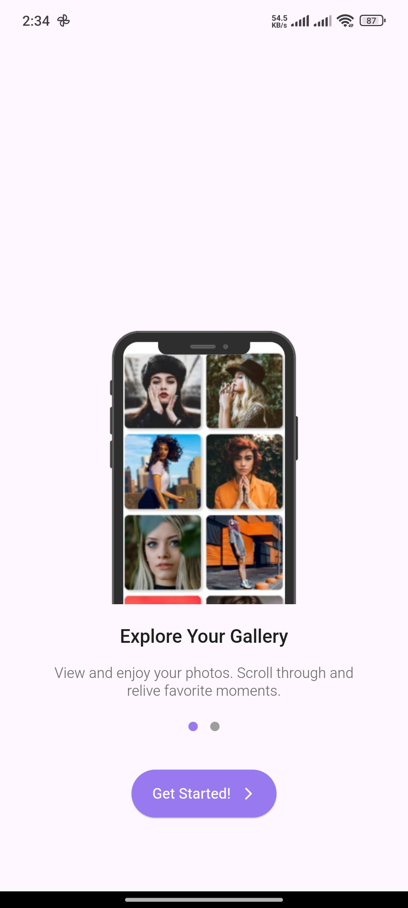
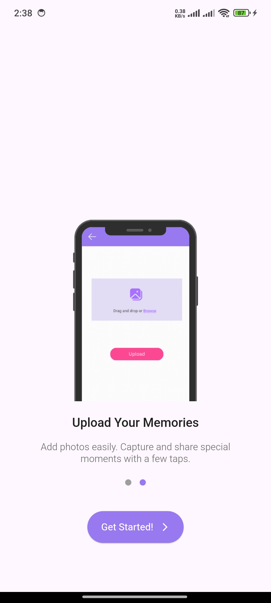
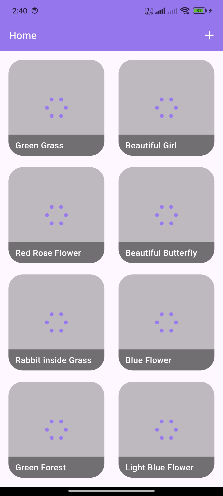
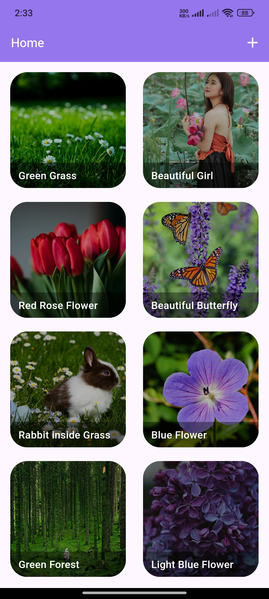
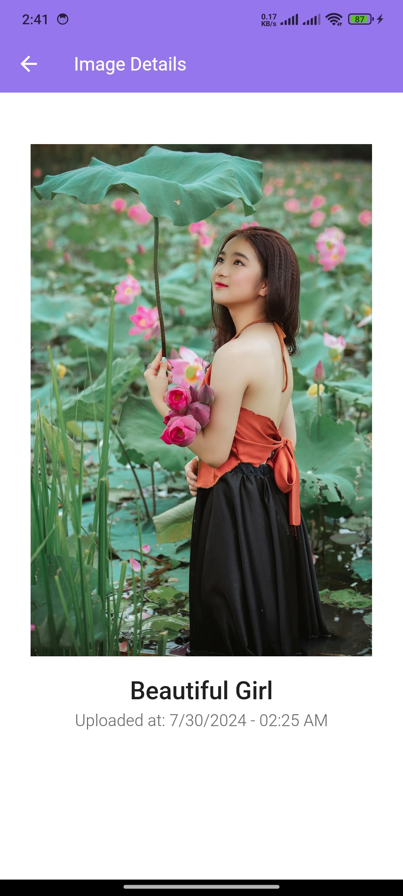
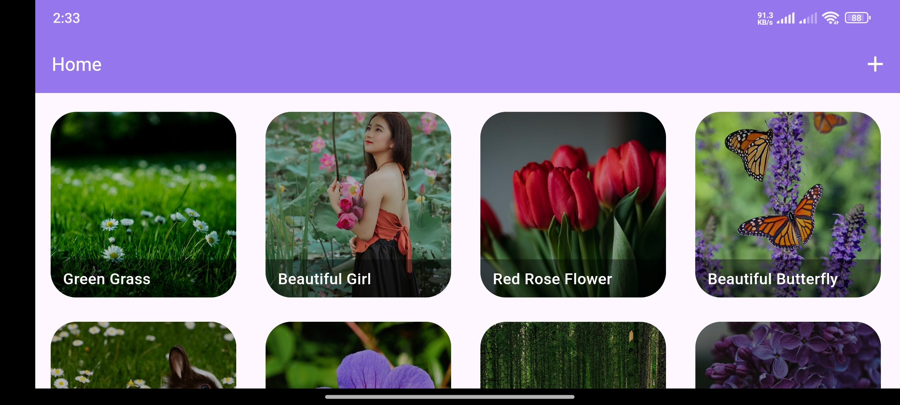
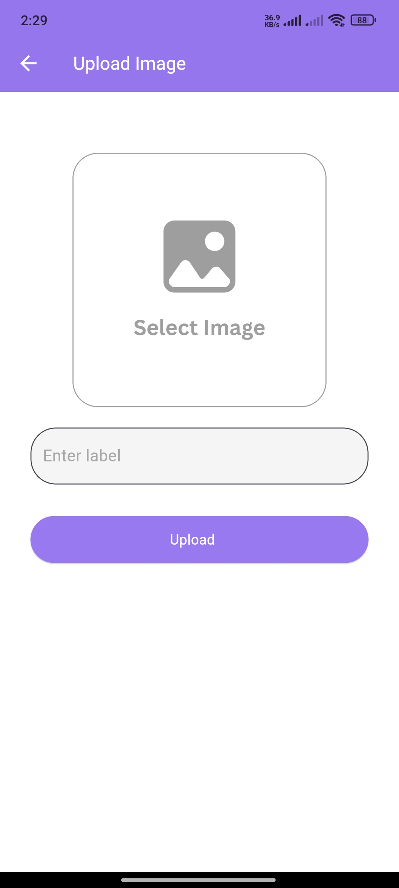
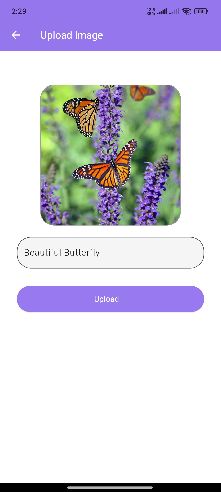

# Personal Gallery App

A Complete Personal Gallery App mage state with GetX and use Firebase for Database.

# The technology I used to make this App.

<ol>
    <li>
        GetX state management.
    </li>
    <li>
        Firebase Firestore & Storage Database.
    </li>
    <li>
        Used OrientationBuilder for responsive design.
    </li>
    <li>
        Used Image picker for select image in gallery.
    </li>
    <li>
        Used FVM for flutter version management.
    </li>
</ol>

## Screenshots

    
    
    
    
    
    
    
    

This project is a starting point for a Flutter application.

A few resources to get you started if this is your first Flutter project:

- [Lab: Write your first Flutter app](https://docs.flutter.dev/get-started/codelab)
- [Cookbook: Useful Flutter samples](https://docs.flutter.dev/cookbook)

For help getting started with Flutter development, view the
[online documentation](https://docs.flutter.dev/), which offers tutorials,
samples, guidance on mobile development, and a full API reference.
